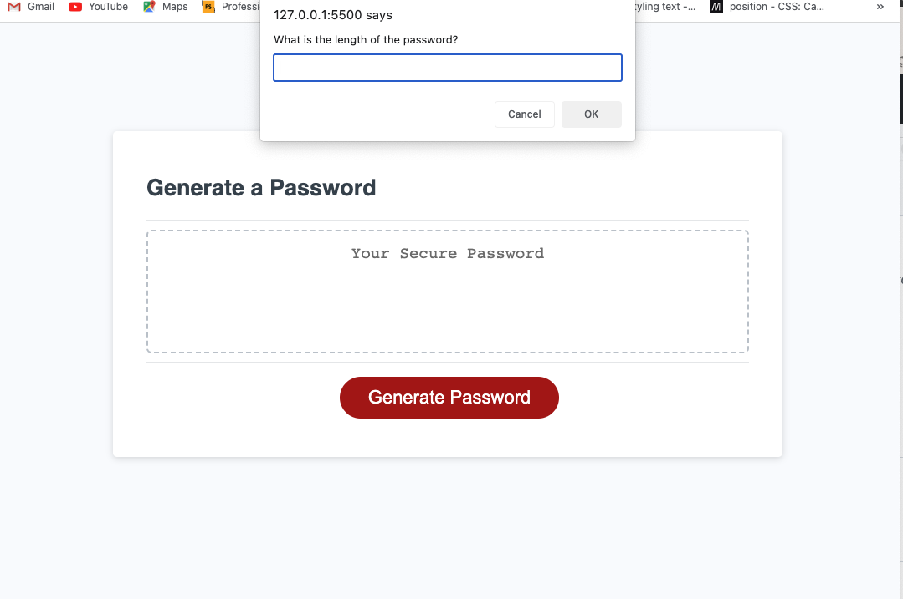

# Password-Generator# Portfolio

## Description

The starter code has been modified to create an application that enables employees to generate random passwords based on criteria that they have selected. This app runs in the browser and features dynamically updated HTML and CSS powered by Javascript code that I wrote. The user can choose password based on length, uppercase and/or lowercase, numbers, and special characters.

Link to completed application below.
https://starrheather1.github.io/Password-Generator/

## Installation

N/A

## Usage

Click generate password to start. Then choose between the options in the pop-ups at the top. The options are ength, uppercase and/or lowercase, numbers, and special characters. Then your password will generate based on the parameters chosen.

## Credits

N/A

## License

Please refer to the license in the repo.

## Screenshots

